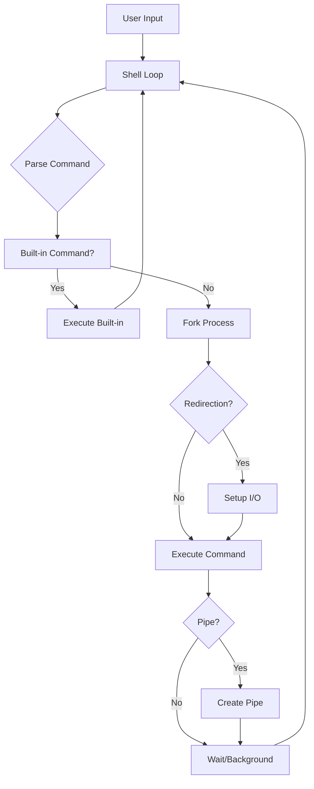

<div align="center">

# 🚀 C Shell

### *A powerful Unix shell implementation with modern features*

[](https://en.wikipedia.org/wiki/C_(programming_language))
[](https://www.unix.org/)
[](LICENSE)
[](#compilation)

*Experience the power of a custom shell with advanced features like piping, I/O redirection, and background processes*

</div>

---

## 🤔 What is a Shell?

A **shell** is a command-line interpreter that provides a user interface for accessing an operating system's services. Think of it as the bridge between you and your computer's core functions.

### 🖥️ **Shell vs Terminal vs Command Prompt**

| **Shell Type** | **Platform** | **Description** |
|----------------|--------------|-----------------|
| 🐧 **Bash** | Linux/macOS | Most popular Unix shell |
| 🐚 **Zsh** | Linux/macOS | Enhanced shell with modern features |
| 🔵 **PowerShell** | Windows | Microsoft's advanced shell |
| ⚫ **CMD** | Windows | Traditional Windows command prompt |
| 🚀 **Our C Shell** | Unix/Linux | Custom implementation with modern features |

### 💡 **Why Build a Custom Shell?**

- 🎓 **Learn** how operating systems work internally
- 🔧 **Understand** process management and system calls
- 🚀 **Customize** your command-line experience
- 💪 **Master** low-level programming concepts

---

## ✨ Features

<table>
<tr>
<td>

### 🎯 **Core Functionality**
- ⚡ Fast command execution
- 🔄 Interactive shell loop
- 📁 Dynamic directory display
- 🛡️ Signal handling (Ctrl+C)
- 🧹 Automatic process cleanup

</td>
<td>

### 🔧 **Advanced Features**
- 🔀 **Piping** - Chain commands (`|`)
- 📤 **I/O Redirection** - `<`, `>`, `>>`
- 🔙 **Background Jobs** - Run with `&`
- 💻 **Built-in Commands** - `cd`, `help`, `exit`
- 🎨 **Colored Prompt** - Shows current directory

</td>
</tr>
</table>

---

## 🚀 Quick Start

### Prerequisites

**⚠️ Platform Requirements:**
- **Unix-like Operating System** (Linux, macOS, BSD)
- **Or Windows with WSL** (Windows Subsystem for Linux)
- **Not compatible with native Windows**

**📦 Build Requirements:**
```bash
# Ensure you have GCC installed
gcc --version

# On Ubuntu/Debian
sudo apt install build-essential

# On macOS
xcode-select --install

# On Windows - Install WSL first
wsl --install
```

### 🔨 Compilation
```bash
git clone https://github.com/Het-2004/Build-your-own-shell.git
cd Build-your-own-shell
gcc -o advanced_shell advanced_shell.c
```

### 🎮 Run the Shell
```bash
./advanced_shell
```

<div align="center">

**You'll see the beautiful prompt:**
```
🚀 /current/working/directory > 
```

</div>

---

## 📖 Usage Guide

### 🏠 Basic Commands
```bash
# List files
🚀 ~/projects > ls -la

# Show current directory
🚀 ~/projects > pwd

# Echo text
🚀 ~/projects > echo "Hello, Advanced Shell!"
```

### 🔧 Built-in Commands

| Command | Description | Example |
|---------|-------------|---------|
| `cd` | Change directory | `cd /home/user/Documents` |
| `help` | Show help menu | `help` |
| `exit` | Exit the shell | `exit` |

### 🔀 Piping Magic
```bash
# Find all C files
🚀 ~/project > ls -la | grep "\.c$"

# Count lines in files
🚀 ~/project > cat *.txt | wc -l

# Search and sort
🚀 ~/project > grep "function" *.c | sort
```

### 📁 I/O Redirection
```bash
# Save output to file
🚀 ~/project > ls -la > file_list.txt

# Append to file
🚀 ~/project > echo "New entry" >> file_list.txt

# Read from file
🚀 ~/project > wc -l < large_file.txt

# Combine both
🚀 ~/project > sort < input.txt > sorted_output.txt
```

### 🔙 Background Processing
```bash
# Run long process in background
🚀 ~/project > sleep 60 &
Started background job with PID: 12345

# Continue using shell immediately
🚀 ~/project > ls
🚀 ~/project > echo "Shell is still responsive!"
```

---

## 🏗️ Architecture

<div align="center">



</div>

### 🧩 Core Components

- **🔄 Shell Loop**: Main interactive loop handling user input
- **⚙️ Command Parser**: Tokenizes and processes command strings  
- **🚀 Process Manager**: Handles fork/exec for external commands
- **🔀 Pipe Handler**: Manages inter-process communication
- **📁 I/O Manager**: Handles file redirection operations
- **🛡️ Signal Handler**: Manages system signals gracefully

---

## 🎯 Advanced Examples

### 🔥 Power User Commands
```bash
# Complex pipeline with redirection
🚀 ~/logs > cat access.log | grep "ERROR" | sort | uniq -c > error_summary.txt

# Background compilation
🚀 ~/project > make all > build.log 2>&1 &

# Multi-step data processing
🚀 ~/data > cat raw_data.csv | cut -d',' -f2 | sort -n | tail -10
```

### 🧪 Testing Your Shell
```bash
# Test I/O redirection
echo "test content" > test.txt
cat < test.txt
cat test.txt | wc -l

# Test background processes
sleep 5 &
ps aux | grep sleep

# Test piping
ls -la | head -5 | tail -3
```

---

## 🔍 Technical Deep Dive

### 🛠️ Implementation Highlights

<details>
<summary><strong>📋 Process Management</strong></summary>

- Uses `fork()` for creating child processes
- `execvp()` for command execution with PATH resolution
- `waitpid()` for proper process synchronization
- Zombie process prevention with `SIGCHLD` handling

</details>

<details>
<summary><strong>🔀 Pipe Implementation</strong></summary>

- Creates anonymous pipes with `pipe()`
- Proper file descriptor duplication with `dup2()`
- Handles both read and write ends correctly
- Supports single-pipe commands (extensible to multiple)

</details>

<details>
<summary><strong>📁 I/O Redirection</strong></summary>

- File descriptor manipulation for stdin/stdout
- Support for input (`<`), output (`>`), and append (`>>`)
- Proper file opening with appropriate flags
- Error handling for file operations

</details>

### 📊 Performance Characteristics

| Feature | Performance | Memory Usage |
|---------|-------------|--------------|
| Command Parsing | O(n) | Fixed buffers |
| Process Creation | Fork overhead | Minimal |
| I/O Redirection | File I/O speed | Low overhead |
| Pipe Operations | Kernel buffered | Efficient |

---

## 🎨 Customization

### 🎯 Modify the Prompt
Edit the prompt in `shell_loop()`:
```c
printf("🚀 %s > ", cwd);  // Current prompt
printf("⭐ %s $ ", cwd);  // Alternative style
printf("[%s] → ", cwd);   // Minimal style
```

### 🔧 Add Built-in Commands
1. Add function declaration
2. Implement the function
3. Add to `builtin_str[]` array
4. Add to `builtin_func[]` array

---

## 🐛 Troubleshooting

### Common Issues

<details>
<summary><strong>❌ Compilation Errors</strong></summary>

```bash
# Missing headers
sudo apt-get install libc6-dev

# GCC not found
sudo apt-get install gcc

# Permission denied
chmod +x advanced_shell
```

</details>

<details>
<summary><strong>🔧 Runtime Issues</strong></summary>

- **Command not found**: Check PATH variable
- **Permission denied**: Verify file permissions
- **Segmentation fault**: Check command length limits
- **Zombie processes**: Built-in SIGCHLD handling

</details>

---

## 🤝 Contributing

<div align="center">

**We welcome contributions! Here's how to get started:**

</div>

### 🌟 How to Contribute

1. **🍴 Fork** the repository
2. **🌿 Create** a feature branch (`git checkout -b feature/amazing-feature`)
3. **✨ Commit** your changes (`git commit -m 'Add amazing feature'`)
4. **📤 Push** to the branch (`git push origin feature/amazing-feature`)
5. **🔄 Open** a Pull Request

### 🎯 Areas for Contribution

- 🔄 Multiple pipe support
- 📚 Command history
- ⌨️ Tab completion
- 🌐 Environment variables
- 📜 Script execution
- 🎮 Job control commands

---

## 🛣️ Roadmap

### 🚀 Upcoming Features

- [ ] 🔄 **Multiple Pipes** - Support `cmd1 | cmd2 | cmd3`
- [ ] 📚 **Command History** - Arrow key navigation
- [ ] ⌨️ **Tab Completion** - Auto-complete commands and files
- [ ] 🌐 **Variables** - Environment variable expansion
- [ ] 📜 **Scripting** - Execute shell scripts
- [ ] 🎮 **Job Control** - `jobs`, `fg`, `bg` commands
- [ ] 🔗 **Aliases** - Custom command shortcuts
- [ ] ⚙️ **Config Files** - `.shellrc` support

---

## 📄 License

This project is licensed under the **MIT License** - see the [LICENSE](LICENSE) file for details.

---

## 🙏 Acknowledgments

<div align="center">

**Special thanks to:**

- 🔧 **Unix Philosophy** - Simple, composable tools
- 📚 **POSIX Standards** - Cross-platform compatibility  
- 🎓 **Educational Goals** - Understanding OS concepts
- 🌟 **Open Source Community** - Inspiration and support

</div>

---

<div align="center">

### 🌟 **Star this repository if you found it helpful!** ⭐

**Made with ❤️ for learning and education**

[](https://github.com/Het-2004/Build-your-own-shell)
[](https://github.com/Het-2004/Build-your-own-shell)

</div>